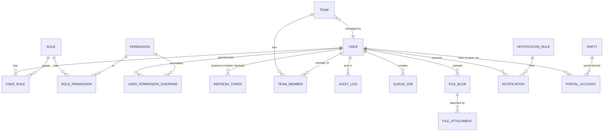
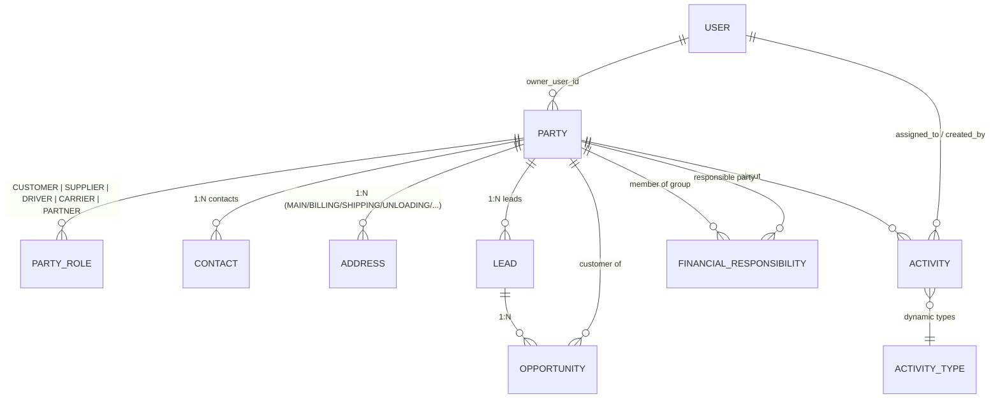
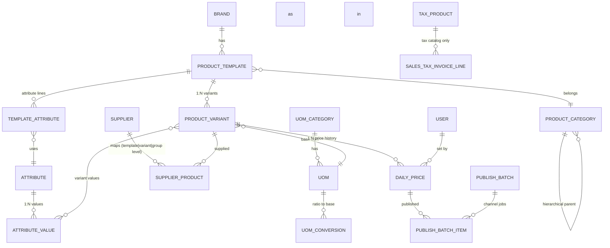
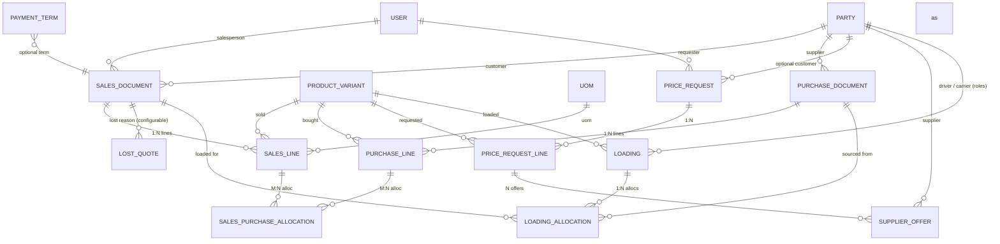
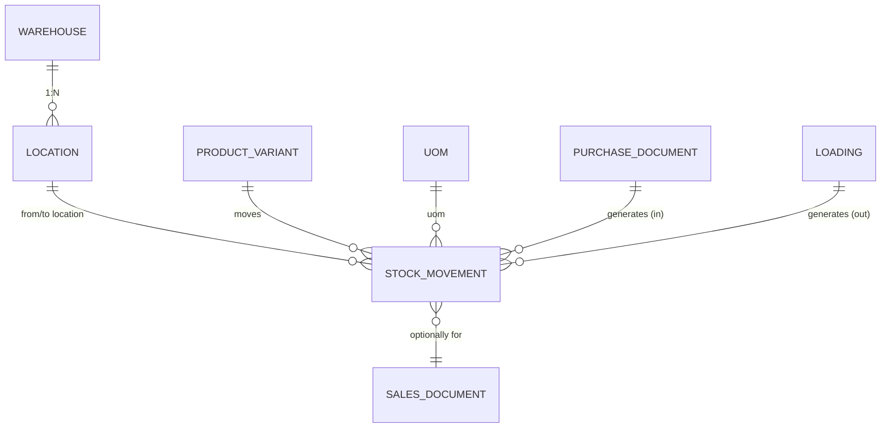
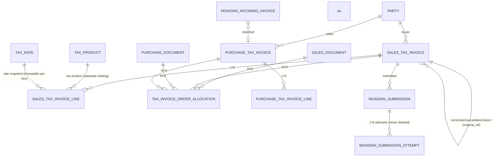
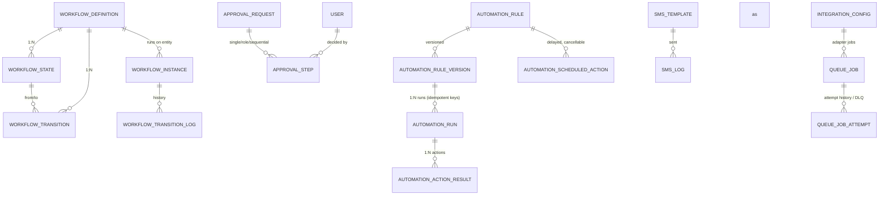

# TCERP — Initial ERD (target model)

Conventions (apply to every table, including Phase-2 modules):

- **PK**: UUID v4 (`gen_random_uuid()`), column `id`.
- **Naming**: snake_case tables & columns via `@@map` / `@map`.
- **Timestamps**: every important entity has `created_at`, `updated_at`, `created_by` and where needed `updated_by`, `archived_at`, `archived_by`.
- **Money**: `NUMERIC(20,4)` — never float. **Quantities**: `NUMERIC(18,4)`. Percent: `NUMERIC(9,4)`.
- **Dates**: stored as `timestamptz` (instant) or `date` (business day); UI renders Jalali by default.
- **Soft delete**: `deleted_at`/`archived_at` for business data; accounting documents use status lifecycle (`DRAFT/POSTED/REVERSED/CANCELLED`), never hard delete.
- **Multi-company readiness**: domain tables carry `company_id` (nullable FK) from introduction; Phase-1 foundation tables omit it (single-company).
- **Optimistic locking**: `version INT` on concurrently-edited documents.

## Diagrams by bounded context

### Identity, Audit & Foundation



### CRM



`PARTY.role` is a multi-valued relation (a company can be CUSTOMER and SUPPLIER simultaneously).
Unique: normalized mobile (exact-duplicate block), `national_id`, `economic_code`.

### Product & Pricing



`DAILY_PRICE`: unique `(product_variant_id, date, source)`; full history retained.

### Sales / Procurement / Loading



`SALES_DOCUMENT.status` (workflow): `DRAFT → QUOTATION → QUOTATION_SENT → CUSTOMER_CONFIRMED →
SALES_ORDER → PARTIALLY_LOADED → COMPLETED → CLOSED` (+ `REOPENED`, `LOST`).
Three distinct quantities: `ordered_quantity`, `loaded_quantity` (sum of actual loadings),
`tax_invoiced_quantity` — never forced equal.

### Inventory



### Tax & Moadian



`TAX_RATE` is append-only: changing VAT creates a new rate row; documents keep a snapshot.
`MOADIAN_SUBMISSION.status`: `NOT_SENT/QUEUED/SENDING/SUBMITTED/WAITING_RESULT/SUCCESS/FAILED/NEEDS_REVIEW`.

### Accounting

```mermaid
erDiagram
    ACCOUNT ||--o{ ACCOUNT : "hierarchical parent"
    FISCAL_YEAR ||--o{ FISCAL_PERIOD : "1:N periods"
    JOURNAL ||--o{ JOURNAL_ENTRY : "1:N"
    JOURNAL_ENTRY ||--o{ JOURNAL_LINE : "1:N (debit==credit enforced)"
    ACCOUNT ||--o{ JOURNAL_LINE : posted to
    PARTY ||--o{ JOURNAL_LINE : "detail (subsidiary ledger)"
    BANK_ACCOUNT ||--o{ BANK_TRANSACTION : "ordered by (date, sequence_no) + running balance"
    PARTY ||--o{ OPERATIONAL_PAYMENT_CLAIM : claimed by
    SALES_DOCUMENT ||--o{ OPERATIONAL_PAYMENT_CLAIM : "declared on"
    OPERATIONAL_PAYMENT_CLAIM ||--o| RECEIPT : "MATCHED → receipt"
    BANK_ACCOUNT ||--o{ RECEIPT : "credits bank"
    BANK_ACCOUNT ||--o{ PAYMENT : "debits bank"
    CHECK ||--o{ BANK_TRANSACTION : "on CLEARED/PAID only"
    PARTY ||--o{ CHECK : "issuer/holder"
    BANK_TRANSACTION ||--o{ RECONCILIATION_ITEM : reconciled in
    RECONCILIATION ||--o{ RECONCILIATION_ITEM : has
    PARTY ||--o{ FINANCIAL_RESPONSIBILITY : "group (A,B → Ravan)"
    DESCRIPTION_TEMPLATE ||--o{ JOURNAL_LINE : "template engine"
```

Invariants: `SUM(JournalLine.debit) == SUM(JournalLine.credit)` (DB constraint/service check);
posted entries immutable (reverse instead); invoices never touch bank directly;
check registration does not change bank balance.

### Workflow / Automation / Platform engines



`AUTOMATION_RUN` carries `idempotency_key UNIQUE` — duplicate event delivery never double-fires
SMS/Activity/Approval. `AUTOMATION_SCHEDULED_ACTION` is cancelled when the guard condition
no longer holds (e.g. quotation confirmed before 3-day follow-up).

## Cardinality summary (required list)

| Relation | Cardinality |
|---|---|
| Party → Address / Contact / PartyRole | 1:N |
| ProductTemplate → ProductVariant | 1:N |
| SalesDocument → SalesLine / PurchaseDocument → PurchaseLine | 1:N |
| Sales ↔ Purchase | **M:N** (`SalesPurchaseAllocation`, line-level) |
| SalesOrder ↔ SalesTaxInvoice | **M:N** (`TaxInvoiceOrderAllocation`, with `allocated_amount`, optional `allocated_quantity`) |
| PurchaseOrder ↔ PurchaseTaxInvoice | **M:N** (same) |
| PriceRequestLine → SupplierOffer | 1:N |
| Loading → Purchase/Sales lines | M:N via `LoadingAllocation` (auto-match in 1:1) |
| MoadianSubmission → Attempts | 1:N (append-only) |
| Party ↔ Role | M:N (`PartyRole`, multiple roles per party) |
| User ↔ Role ↔ Permission | M:N + per-user overrides |

## Key indexes & unique constraints

| Table | Constraint / Index | Why |
|---|---|---|
| `users` | UNIQUE `username`, `email` | login |
| `parties` | UNIQUE `normalized_mobile` (partial, where deleted_at is null); index `national_id`, `economic_code`; trigram/GIN index on name for similarity search | duplicate detection |
| `sales_documents` | UNIQUE `document_number` (per sequence/company); index `(status, date)`, `customer_id`, `salesperson_id` | lists & reports |
| `purchase_documents` | UNIQUE `document_number`; index `(supplier_id, date)` | same |
| `daily_prices` | UNIQUE `(product_variant_id, date)`; index `(product_variant_id, date DESC)` | "today's price" lookup |
| `supplier_offers` | index `(price_request_line_id)`, `(supplier_id, date)` | supplier intelligence |
| `tax_invoice_order_allocations` | UNIQUE `(invoice_id, order_type, order_id)` | no double-allocation |
| `journal_entries` | UNIQUE `entry_number`; index `(journal_id, date)`, `(status)` | ledger |
| `bank_transactions` | UNIQUE `(bank_account_id, date, sequence_no)` | running balance integrity |
| `checks` | index `(status, due_date)` | due-date notifications |
| `queue_jobs` | UNIQUE `idempotency_key` (nullable); index `(status, priority, scheduled_at)` | worker claim |
| `audit_logs` | index `(entity_type, entity_id)`, `actor_id`, `created_at` | timeline & review |
| `file_blobs` | UNIQUE `sha256` | content dedupe |
| `refresh_tokens` | UNIQUE `token_hash`; index `user_id` | auth |
| `moadian_submission_attempts` | UNIQUE `(submission_id, attempt_no)` | append-only history |
| `portal_accounts` | UNIQUE `verified_mobile` (canonical); FK `party_id` | portal linking |
| all `_allocations` | FK indexes on both sides; `CHECK (quantity > 0)` | integrity |
| documents (money) | `CHECK (amount >= 0)` where applicable; journal `CHECK (debit = 0 OR credit = 0)` | accounting integrity |
