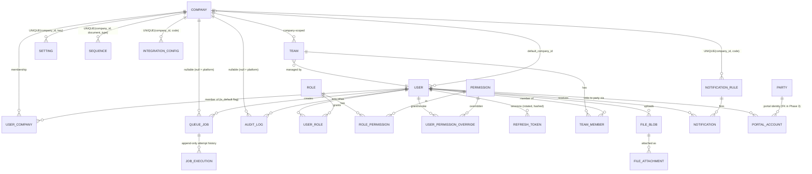
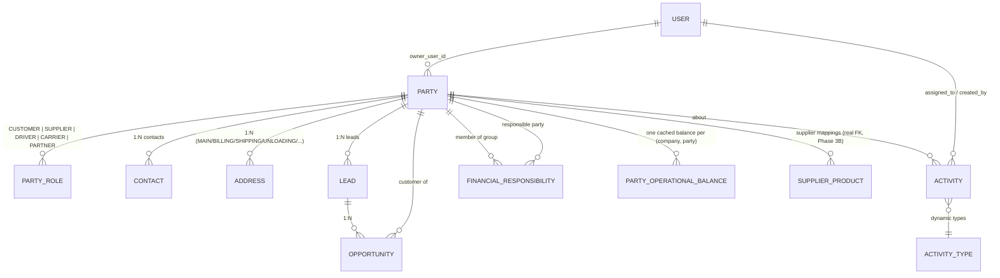
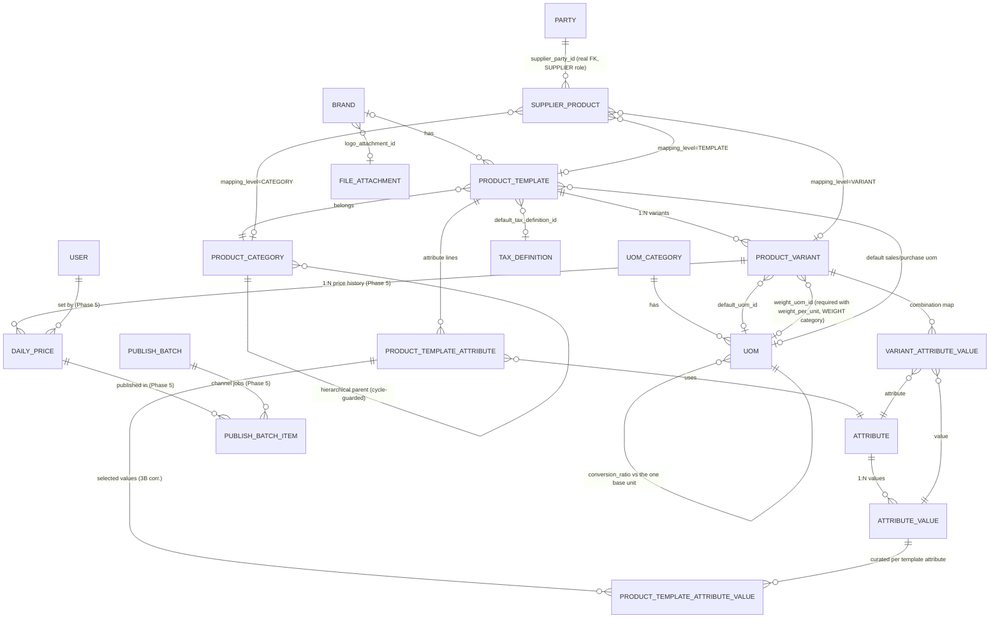
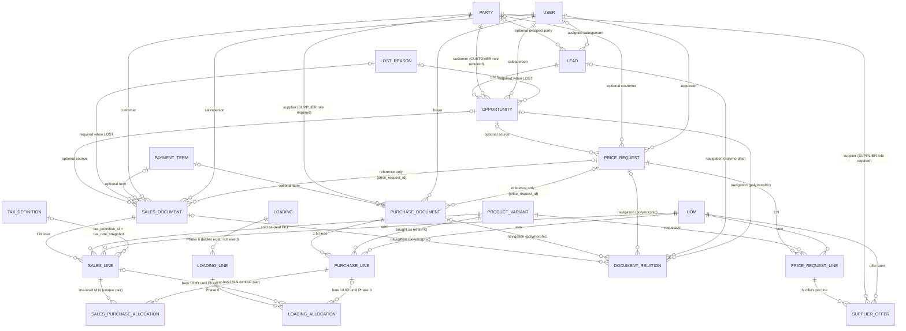
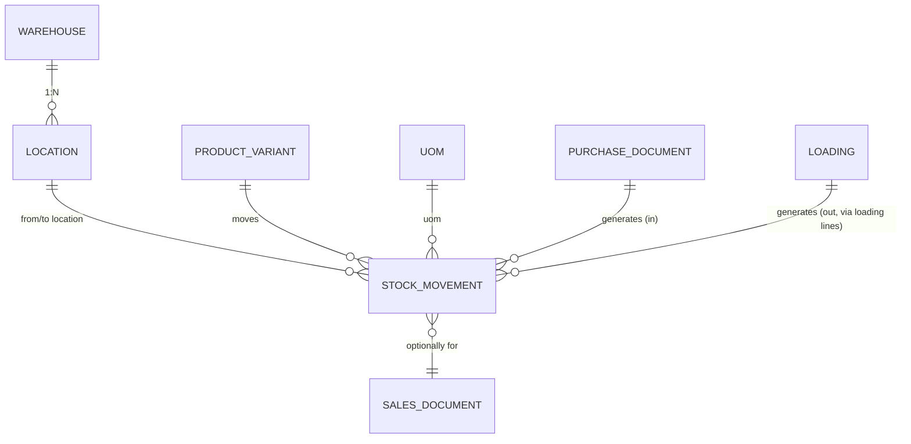
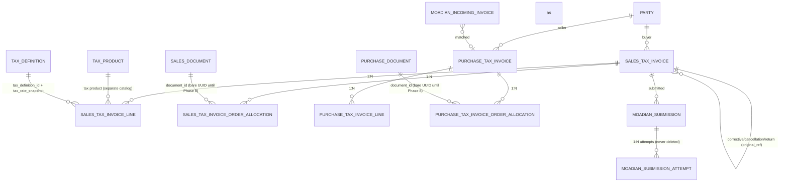
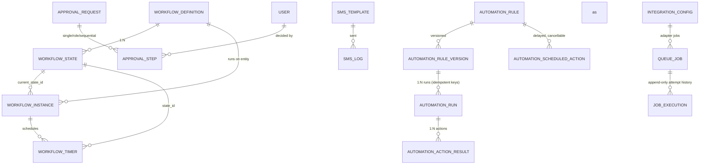

# TCERP — ERD (after the Architecture Correction Gate; Phase 3A/3B, 3B corrections and Phase 4 landed — 2026-10-06)

Conventions (apply to every table, including Phase-2 modules):

- **PK**: UUID v4 (`gen_random_uuid()`), column `id`.
- **Naming**: snake_case tables & columns via `@@map` / `@map`.
- **Timestamps**: every important entity has `created_at`, `updated_at`, `created_by` and where needed `updated_by`, `archived_at`, `archived_by`.
- **Money**: `NUMERIC(20,4)` — never float. **Quantities**: `NUMERIC(18,4)`. Percent: `NUMERIC(9,4)`.
- **Dates**: stored as `timestamptz` (instant) or `date` (business day); UI renders Jalali by default.
- **Soft delete**: `deleted_at`/`archived_at` for business data; accounting documents use status lifecycle (`DRAFT/POSTED/REVERSED/CANCELLED`), never hard delete.
- **Multi-company from day one** (Correction Gate #1): `companies` + `user_companies` exist now;
  `users.default_company_id` resolves the active company. Company scope is **mandatory** on
  `teams`, `settings`, `sequences`, `integration_configs`, `notification_rules`; **nullable**
  (null = platform-level) on `queue_jobs` and `audit_logs`. Roles/Permissions stay system-level;
  company-specific role bindings are supported through `user_companies` (see §Identity).
  All "natural" unique constraints are company-scoped (see the constraint table below).
- **Optimistic locking**: `version INT` on concurrently-edited documents (e.g. `journal_entries`,
  `party_operational_balances`) and on the Phase 3B product catalog entities
  (`product_categories`, `brands`, `product_templates`, `product_variants`).
- **Phase-N FKs**: columns whose target tables land with their own phase exist first as bare
  UUIDs so corrected relations never need renumbering; the FK constraints are added by those
  phases' migrations. **Landed so far**: Party → Phase 3A, Product → Phase 3B (+ the 3B
  corrections), and since **Phase 4** the sales/purchase side is real: `sales_documents`,
  `sales_lines`, `purchase_documents`, `purchase_lines`, `sales_purchase_allocations`,
  `price_requests`, `price_request_lines`, `supplier_offers`, `document_relations` all carry
  real FKs (variants, UOMs, parties, tax definitions). **Still bare UUIDs** (marked
  "FK in Phase N" below): `loading_lines.product_variant_id`/`uom_id` and
  `loading_allocations.sales_line_id`/`purchase_line_id` (wired in Phase 6),
  `operational_settlement_claims.sales_document_id`/`purchase_document_id` (Phase 7),
  tax-invoice allocation document ids (Phase 8).
  Ground truth for field names: `apps/backend/prisma/schema.prisma`
  (migrations `20241006000000_correction_gate`, `20241006120000_party_operational_balance`,
  `20241006150000_mini_gate`, `20241006170000_phase3a_party_crm`,
  `20241007000000_p3a_corrections`, `20241007100000_phase3b_product_catalog`,
  `20241008000000_p3b_corrections`, `20241008100000_phase4_sales_purchase`,
  `20241008110000_restore_raw_indexes`).

## Diagrams by bounded context

### Identity, Companies, Audit & Foundation



- `USER_COMPANY` PK is `(user_id, company_id)` with `is_default BOOLEAN`; index `company_id`.
  Roles/Permissions are **system-level**; company-specific role bindings resolve through
  `user_companies` (future role-scope columns) — permission checks scope via membership.
- `QUEUE_JOB.company_id` / `AUDIT_LOG.company_id` are **nullable**: null = platform-level.
- `JOB_EXECUTION` (append-only, `UNIQUE(job_id, attempt_no)`) is the durable per-attempt
  business history; BullMQ/Redis owns only runtime execution (see Architecture doc).

### CRM



`PARTY.role` is a multi-valued relation (a company can be CUSTOMER and SUPPLIER simultaneously).
Unique: normalized mobile (exact-duplicate block), `national_id`, `economic_code`.
Party tables landed in **Phase 3A** (commit `1f57758`); the 3A corrective pass (`f32fe7f`)
added pg_trgm search + lightweight grid projection, company-member owners, company-scoped
team scopes and **transactional audit atomicity** (`AuditService.recordTx(tx)` — audit rows
are written inside the mutation transaction; failure propagates and rolls back both).
These are service-level concerns: no schema change, but see the p3a-corrections partial
unique indexes in the index table below. `PARTY_OPERATIONAL_BALANCE` exists
(`UNIQUE(company_id, party_id)`, `balance NUMERIC(20,4)`, optimistic `version`).

The CRM funnel is **real since Phase 4** (migration `20241008100000_phase4_sales_purchase`):
`Lead` (status `NEW → CONTACTED → QUALIFIED | LOST`, optional prospect `party_id`, assigned
salesperson must be an active company member), `Opportunity` (status
`OPEN → QUALIFIED → QUOTED → WON | LOST`; a returning customer gets a **NEW Opportunity per
buying intent** — the Party master never changes; customer must hold the CUSTOMER role,
422 `NOT_A_CUSTOMER`; `lost_reason_id` REQUIRED when LOST), configurable `LostReason`
(`UNIQUE(company_id, code)`, 6 Persian defaults seeded) and `PaymentTerm`
(`UNIQUE(company_id, code)`, 4 Persian defaults seeded). `Activity`/`ActivityType` remain
Phase 9.

### Product & Pricing

Implemented in **Phase 3B** (`20241007100000_phase3b_product_catalog`, commit `2989f4f`)
plus the **3B correction pass** (commits `e24fb73` schema / `2b64b81` backend, migration
`20241008000000_p3b_corrections`); ground truth `apps/backend/prisma/schema.prisma`
(Product Catalog section) and `apps/backend/src/products/*`.



- **ProductCategory**: hierarchical (`parent_id`, arbitrary depth); moving a category under
  itself or a descendant is blocked (422 `CATEGORY_CYCLE`, service-level cycle guard);
  `UNIQUE(company_id, code)`; bilingual `name_fa`/`name_en`; optimistic `version`.
- **Brand**: `logo_attachment_id` → `file_attachments` (validated same-company via the files
  module); `UNIQUE(company_id, code)`; GIN trgm index on `name_fa`; optimistic `version`.
- **UOM engine** (3B + corrections): `UomCategory` + `Uom` with `conversion_ratio
  DECIMAL(20,6)` measured against the category's base unit — **at most one** `is_base_unit`
  per category (partial unique `uoms_base_unit_uniq (category_id) WHERE is_base_unit`; a
  category may transiently have NO base, which blocks conversion with 422
  `UOM_NO_BASE_UNIT` until one exists). Base ratio must be exactly 1 (422
  `UOM_BASE_RATIO_ONE`); any `conversion_ratio <= 0` is rejected by the DB CHECK
  `uoms_conversion_ratio_positive_chk` (mapped to 422 `UOM_RATIO_POSITIVE`). Cross-category
  conversion is blocked (422 `UOM_CATEGORY_MISMATCH`); `POST /api/products/uom/convert` uses
  Decimal arithmetic only. `UomConversionService.convertWithProductWeight` handles
  `weight_per_unit`-carrying variants (quantity × weightPerUnit in the variant's weight UOM,
  then standard Weight-category conversion — e.g. 100 pcs × 18.7 kg = 1870 kg → 1.87 ton).
  No separate `UomConversion` table — ratios live on `uoms`.
- **Attribute / AttributeValue**: fully dynamic (REQUIREMENTS §5); `UNIQUE(company_id, code)`
  on attributes, `UNIQUE(attribute_id, code)` on values; optional `numeric_value
  DECIMAL(20,6)` for numeric attributes.
- **ProductTemplate**: Odoo-style commercial family — `category_id` (required),
  `brand_id?`, `default_sales_uom_id?` / `default_purchase_uom_id?`,
  `default_sales_price NUMERIC(20,4)`, `default_tax_definition_id?` (FK → `tax_definitions`),
  `product_type (STORABLE|CONSUMABLE|SERVICE)`, `is_sellable`/`is_purchasable`,
  optimistic `version`; `UNIQUE(company_id, internal_code)`.
- **ProductTemplateAttribute**: `(template_id, attribute_id)` UNIQUE with `display_order`,
  `creates_variants` (defines the variant space), `is_required`.
- **ProductTemplateAttributeValue** (3B correction, `e24fb73`): the SELECTED values allowed
  for a template attribute — `UNIQUE(template_attribute_id, attribute_value_id)`,
  `display_order`, `active`; a candidate value must belong to the template attribute's
  attribute (else 422 `ATTRIBUTE_VALUE_MISMATCH`). Preview / matrix / variant generation
  build combinations ONLY from these selected active values; while an attribute has none
  selected yet it falls back to the attribute's GLOBAL active values
  (`TemplatesService.effectiveUniverse` — transitional rule, disappears once the first value
  is selected).
- **ProductVariant**: `UNIQUE(company_id, sku)`; `weight_per_unit NUMERIC(18,4)?` with an
  **explicit `weight_uom_id`** (3B correction — required whenever `weight_per_unit` is set,
  422 `WEIGHT_UOM_REQUIRED`; must belong to the company's Weight UOM category, resolved
  canonically by category `code === 'WEIGHT'`); `default_uom_id?`, optimistic `version`.
  **`combination_key`** (3B correction): canonical sorted `attribute_id=attribute_value_id`
  pairs joined with `|` (`buildCombinationKey`, deterministic; existing rows backfilled);
  `UNIQUE(template_id, combination_key)` is the ONLY duplicate-combination authority at the
  DB level — a concurrent generate racing past the in-transaction pre-check aborts with P2002
  → 409 `VARIANT_COMBINATION_EXISTS`. Variants are generated in ONE transaction from the
  template's selected `createsVariants` values — existing identical combinations are
  **skipped with a report** (`{created[], skipped[]}`), never duplicated or mutated; SKU
  collisions are auto-suffixed `-2`, `-3` then 409 `VARIANT_SKU_COLLISION`.
- **VariantAttributeValue**: explicit relation rows (no JSON) — **one value per attribute per
  variant**: `UNIQUE(variant_id, attribute_id)` and `UNIQUE(variant_id, attribute_value_id)`.
- **SupplierProduct**: now carries **real FKs** — `supplier_party_id` → `parties`
  (supplier must hold the SUPPLIER role in the same company, else 422 `NOT_A_SUPPLIER`),
  and the level FKs → `product_variants` / `product_templates` / `product_categories`
  (all validated same-company).

`DAILY_PRICE`, `PUBLISH_BATCH(_ITEM)` and `TAX_PRODUCT` are **future** (Phase 5 daily pricing +
publishing; `TAX_PRODUCT` with the Phase 8 tax/Moadian module) — kept in the diagram as
planned nodes only; the Phase 5 `DailyPrice` engine now references **real** `ProductVariant`
rows.

**SupplierProduct is genuinely three-level** (Correction Gate #6): exactly one of
`product_variant_id` / `product_template_id` / `category_id` is set, enforced by DB CHECK
`supplier_products_exactly_one_level_chk` (mapping_level must match the one non-null FK) and
again in the service. Indexes: `(company_id, supplier_party_id)` plus per-target indexes.

### Sales / Procurement / Price Requests / Document Flow (Phase 4 — implemented)

Schema landed in **Phase 4** (commit `c467f85`, migration `20241008100000_phase4_sales_purchase`
+ `20241008110000_restore_raw_indexes`); services in
`apps/backend/src/{crm,sales,purchase,allocations,price-request,document-flow}`.
**Loading stays Phase 6**: its tables exist since the Correction Gate, but the line FKs
(`loading_lines.product_variant_id`/`uom_id`, `loading_allocations.sales_line_id`/
`purchase_line_id`) are still bare UUIDs until the Phase 6 migration wires them.



- **SalesDocument = ONE entity for quotation → sales order** (NON-NEGOTIABLE, REQUIREMENTS
  §9): quotation and sales order share ONE `id` and ONE `document_number`; the number is
  allocated **once at creation** from the `SALES_DOCUMENT(SD)` sequence and **never
  regenerated** — only the status moves. `UNIQUE(company_id, document_number)`.
  Statuses: `DRAFT → QUOTATION → SENT → CUSTOMER_CONFIRMED → SALES_ORDER →
  PARTIALLY_LOADED → COMPLETED`, with `CANCELLED` and `LOST` as terminal states
  (`LOST` requires the reason per Setting `sales.lost_reason_required`).
  **Confirmation lock**: after `CUSTOMER_CONFIRMED` the line fields (variant / quantity /
  uom / price / discount) are locked — editing without `sales.override_confirmed_order` is
  403 `ORDER_LOCKED`; a permission holder MAY override but MUST pass a `reason`
  (422 `OVERRIDE_REASON_REQUIRED`), which lands in an `OVERRIDE_CONFIRMED_ORDER` audit row
  (old/new + reason) plus a party timeline event, all in the mutation transaction.
  Header totals (`subtotal/discount_total/tax_total/total`) are **server-authoritative**
  exact `Decimal(20,4)` math; `SalesLine` carries `printable_description` (matrix default:
  template nameFa + attribute values joined with ` / `), `ordered_quantity`, `unit_price`,
  optional `tax_definition_id` + `tax_rate_snapshot`. Sales record scope OWN/TEAM/ALL
  keyed on the document's salesperson (backend-enforced, mirrors the party precedent).
  `price_request_id` on the document is **reference only** — never required (purchase/sale
  independence preserved).
- **PurchaseDocument is independent** (no PriceRequest or sale required): statuses
  `DRAFT → ORDER_PLACED → PARTIALLY_LOADED → COMPLETED` (+ `CANCELLED`); supplier must hold
  the SUPPLIER role (422 `NOT_A_SUPPLIER`), buyer must be an active company member;
  company-wide visibility (no record scope). `create-purchase-from-sale` /
  `create-sale-from-purchase` copy lines and write reciprocal `CREATED_FROM` relations.
- **SalesPurchaseAllocation**: line-level **M:N** between `sales_lines` and `purchase_lines`,
  `UNIQUE(sales_line_id, purchase_line_id)` (one allocation row per pair, quantity editable)
  with indexes on both sides; both lines must be same-company and same-variant
  (422 `ALLOCATION_VARIANT_MISMATCH`). Over-allocation is guarded by a **SERIALIZABLE
  transaction + `SELECT … FOR UPDATE` on both lines taken in consistent id order** — under
  concurrent over-allocation exactly one writer wins (409 `ALLOCATION_EXCEEDS_QUANTITY`).
- **PriceRequest is independent** (customer optional, must hold CUSTOMER role when given):
  statuses `OPEN → OFFERED → CONVERTED | CLOSED`; `UNIQUE(company_id, request_number)`
  (`PRQ-…`). Lines carry variant / requested quantity / uom. **SupplierOffer**: several per
  line; the first offer moves the request OPEN→OFFERED; offers are editable/deletable only
  by their owner and blocked after conversion. Daily-lowest is **derived, not stored**:
  `RANK() OVER (PARTITION BY day, product_variant_id, uom_id ORDER BY offered_price ASC)`
  with `rnk = 1` — ties mean **ALL co-lowest offers** (no stored boolean); comparison is
  within the same uom group (cross-uom normalization deferred to Phase 5). The worklist
  `{today, previousDays}` shows a still-OPEN previous-day request under `previousDays` as
  the **SAME record** (never copied or deleted). `TodayPriceProvider` is a Phase 4
  **interface** bound to the `TODAY_PRICE_PROVIDER` token with a `NullTodayPriceProvider`
  default (always null — a pricing outage must never block a request); the concrete daily
  pricing engine lands in Phase 5.
- **DocumentRelation** (navigation layer, complements FKs): polymorphic
  `(from_type, from_id) → (to_type, to_id)` with `relation_type`
  `CREATED_FROM | GENERATED_FROM | RELATED | BASED_ON` and
  `UNIQUE(from_type, from_id, to_type, to_id, relation_type)`; no hard FKs — it links any
  two of `sales_document` / `purchase_document` / `price_request` / `lead` / `opportunity`.
  `GET /api/documents/:type/:id/relations` returns grouped counts + labelled items in both
  directions with reciprocal pairs deduped.

**Loading = header + lines + allocations (Phase 6 — tables exist, FKs not yet wired)**
(Correction Gate #5):
- `LOADING` header: `company_id`, `loading_date`, `driver_party_id`, `carrier_party_id`
  (driver/carrier are Party roles; both FKs land with Phase 3 parties when wired). Index
  `(company_id, loading_date)`.
- `LOADING_LINE`: `loading_id`, `product_variant_id` (bare UUID, Phase 6 FK),
  `actual_quantity`, `uom_id` (bare UUID, Phase 6 FK), `notes`. Index `loading_id`.
- `LOADING_ALLOCATION`: `loading_line_id`, `sales_line_id` **or** `purchase_line_id`
  (bare UUIDs, Phase 6 FKs), `allocated_quantity`. CHECK `loading_allocations_target_chk`:
  `(sales_line_id IS NOT NULL OR purchase_line_id IS NOT NULL) AND allocated_quantity > 0`.
- A loading is registered **once** and is shown on both the sale and the purchase side.

### Inventory



### Tax & Moadian



**No generic polymorphic allocation** (Correction Gate #4): two explicit tables —
`SALES_TAX_INVOICE_ORDER_ALLOCATION` (`sales_tax_invoice_id` FK in Phase 8, `sales_document_id`
— target table real since Phase 4, FK constraint lands with the Phase 8 tax invoices,
`allocated_amount`, optional `allocated_quantity`;
`UNIQUE(sales_tax_invoice_id, sales_document_id)`, index `sales_document_id`) and
`PURCHASE_TAX_INVOICE_ORDER_ALLOCATION` (same pattern with `purchase_tax_invoice_id` /
`purchase_document_id`).

`TAX_DEFINITION` (Correction Gate #11): company-scoped (`UNIQUE(company_id, code)`,
e.g. `VAT_9`), append-only after first use — a rate change inserts a **new** row. Invoice
lines carry `tax_definition_id` + `tax_rate_snapshot` (Phase 8 columns on invoice lines);
documents never change retroactively.
`MOADIAN_SUBMISSION.status`: `NOT_SENT/QUEUED/SENDING/SUBMITTED/WAITING_RESULT/SUCCESS/FAILED/NEEDS_REVIEW`.

### Accounting & Finance

```mermaid
erDiagram
    COMPANY ||--o{ CHART_OF_ACCOUNT : "UNIQUE(company_id, code)"
    CHART_OF_ACCOUNT ||--o{ CHART_OF_ACCOUNT : "hierarchical parent"
    COMPANY ||--o{ JOURNAL_ENTRY : "UNIQUE(company_id, entry_number)"
    JOURNAL_ENTRY ||--o{ JOURNAL_LINE : "1:N"
    CHART_OF_ACCOUNT ||--o{ JOURNAL_LINE : posted to
    PARTY }o--o| JOURNAL_LINE : "subsidiary detail (party_id, FK in Phase 3)"
    JOURNAL_ENTRY ||--o{ BANK_STATEMENT_LINE : "journal_entry_id (projection)"
    JOURNAL_ENTRY }o--o| JOURNAL_ENTRY : "reversed_by_entry_id"
    COMPANY ||--o{ BANK_ACCOUNT : "company-scoped"
    BANK_ACCOUNT ||--o{ BANK_STATEMENT_LINE : "ordered ledger"
    PARTY }o--o| RECEIPT : "party_id (FK in Phase 3)"
    PARTY }o--o| PAYMENT : "party_id (FK in Phase 3)"
    PARTY }o--o| CHECK : "party_id (FK in Phase 3)"
    PARTY ||--o{ OPERATIONAL_SETTLEMENT_CLAIM : "party_id (FK in Phase 3)"
    SALES_DOCUMENT |o--o{ OPERATIONAL_SETTLEMENT_CLAIM : "CUSTOMER_RECEIPT (bare UUID until Phase 7)"
    PURCHASE_DOCUMENT |o--o{ OPERATIONAL_SETTLEMENT_CLAIM : "SUPPLIER_PAYMENT (bare UUID until Phase 7)"
    OPERATIONAL_SETTLEMENT_CLAIM |o--o| RECEIPT : "MATCHED → matched_receipt_id"
    OPERATIONAL_SETTLEMENT_CLAIM |o--o| PAYMENT : "MATCHED → matched_payment_id"
    BANK_ACCOUNT ||--o{ RECEIPT : "credits bank"
    BANK_ACCOUNT ||--o{ PAYMENT : "debits bank"
    BANK_ACCOUNT ||--o{ BANK_TRANSFER : "source / destination"
    BANK_ACCOUNT |o--o{ CHECK : "bank_account_id (required before CLEARED/PAID)"
    PARTY ||--o{ FINANCIAL_RESPONSIBILITY : "group (A,B → Ravan)"
    DESCRIPTION_TEMPLATE ||--o{ JOURNAL_LINE : "template engine"
    RECONCILIATION ||--o{ RECONCILIATION_ITEM : "planned (Phase 7)"
    BANK_STATEMENT_LINE ||--o{ RECONCILIATION_ITEM : "reconciled via is_reconciled"
```

Invariants (Correction Gates #2, #12):

- **No standalone `BankTransaction` source of truth.** Treasury sources are `RECEIPT`,
  `PAYMENT`, `BANK_TRANSFER`, incoming-check **clearing**, outgoing-check **payment** and
  (later, permission-sensitive) `BANK_ADJUSTMENT`. `BANK_STATEMENT_LINE` is a **non-source**
  ledger used for deterministic daily ordering, `sequence_no`, `running_balance`,
  `reference_number`, reconciliation and source links
  (`source_entity_type` + `source_entity_id` + `journal_entry_id` + `is_reconciled`).
  Direction is `DEPOSIT | WITHDRAWAL`; `CHECK bank_statement_amount_positive_chk (amount > 0)`.
  Gapless numbering is **not** required; deterministic ordering is.
- **JournalEntry** statuses `DRAFT → POSTED` (or `REVERSED`/`CANCELLED`); posted entries are
  **never edited or deleted** — corrections are made by a reversal entry (`reversed_by_entry_id`).
- **JournalLine** CHECK `journal_lines_debit_credit_chk`: `debit >= 0 AND credit >= 0 AND NOT
  (debit > 0 AND credit > 0)`. `SUM(debit) == SUM(credit)` is enforced inside the POST
  transaction (JournalService), not by a stored CHECK.
- **BankTransfer X with fee F**: Dr Destination Bank X, Dr Bank Fee Expense F, Cr Source Bank
  X+F. Statement lines: source `WITHDRAWAL X+F`, destination `DEPOSIT X`. CHECK
  `bank_transfers_amount_chk`: `amount > 0 AND fee >= 0 AND source_bank_account_id <>
  destination_bank_account_id`.
- **Check** direction-specific lifecycle: incoming `REGISTERED → PENDING → DEPOSITED →
  CLEARED | BOUNCED | CANCELLED`; outgoing `REGISTERED → PENDING → PAID | BOUNCED |
  CANCELLED`. Bank effect happens **only** on incoming `CLEARED` / outgoing `PAID`
  (`bank_account_id` must be set before those transitions); registration never moves bank balance.
- **Invoices NEVER touch bank directly.**
- **OperationalSettlementClaim** (Correction Gate #3, replaces the sale-only
  `OperationalPaymentClaim`): `direction = CUSTOMER_RECEIPT` requires `sales_document_id`,
  `SUPPLIER_PAYMENT` requires `purchase_document_id` (CHECK `claims_direction_document_chk`);
  `party_id` always set (FK in Phase 3); statuses `UNMATCHED / MATCHED / REJECTED`. A claim has
  **no bank effect until matched** (matching creates the `RECEIPT`/`PAYMENT` via
  `matched_receipt_id` / `matched_payment_id`). `REJECTED` **restores** the operational balance
  (`PARTY_OPERATIONAL_BALANCE`, optimistic `version`) and emits audit + timeline + notification.
  CHECK `claims_amount_positive_chk (amount > 0)`; indexes `(company_id, status)`,
  `(party_id, status)`.

### Workflow / Automation / Platform engines



`WORKFLOW_TIMER` (Correction Gate #7) is a **runtime** entity owned by the Workflow engine and
executed via the queue: `workflow_instance_id`, `state_id`, `timer_type`
(`ESCALATION | REMINDER | TIMEOUT`), `due_at`, `status`
(`SCHEDULED | EXECUTED | CANCELLED | FAILED`), `action_config` (JSON), `executed_at`.
Index `(status, due_at)` for the dispatcher poll. (WorkflowDefinition/State/Instance are the
minimal foundation tables; transitions and transition logs arrive with the full Phase 9 engine.)

`AUTOMATION_RUN` carries `idempotency_key UNIQUE` — duplicate event delivery never double-fires
SMS/Activity/Approval. `AUTOMATION_SCHEDULED_ACTION` is cancelled when the guard condition
no longer holds (e.g. quotation confirmed before 3-day follow-up).

## Cardinality summary (required list)

| Relation | Cardinality |
|---|---|
| Company → UserCompany → User | **M:N** with `is_default`; `users.default_company_id` = default |
| Company → Team / Setting / Sequence / IntegrationConfig / NotificationRule / TaxDefinition / BankAccount / ChartOfAccount / JournalEntry / Receipt / Payment / BankTransfer / Check / Claim / Loading / WorkflowDefinition / PortalAccount | 1:N (mandatory company scope) |
| Company → QueueJob / AuditLog | 1:N, `company_id` nullable (null = platform) |
| Party → Address / Contact / PartyRole | 1:N |
| ProductTemplate → ProductVariant | 1:N; variant space = template's `createsVariants` attributes; VariantAttributeValue rows give **one value per attribute per variant** |
| ProductVariant → Uom (default) / Template → sales/purchase Uom | 0..1 each; conversions only inside one UomCategory (Decimal ratio vs the single base unit) |
| Party → Lead → Opportunity | 1:N → 1:N funnel (Phase 4); a returning customer gets a **NEW Opportunity per buying intent**; LostReason required when LOST |
| ProductTemplateAttribute → ProductTemplateAttributeValue | 1:N selected values (`UNIQUE(template_attribute_id, attribute_value_id)`); global-value fallback only while none selected |
| SalesDocument → SalesLine / PurchaseDocument → PurchaseLine | 1:N (Phase 4; lines cascade with the document) |
| Sales ↔ Purchase | **M:N** (line-level `SalesPurchaseAllocation`, `UNIQUE(sales_line_id, purchase_line_id)`, same variant both sides, over-allocation guarded — Phase 4) |
| SalesOrder ↔ SalesTaxInvoice | **M:N** (`SalesTaxInvoiceOrderAllocation`, `UNIQUE` pair, amounts + optional quantity) |
| PurchaseOrder ↔ PurchaseTaxInvoice | **M:N** (`PurchaseTaxInvoiceOrderAllocation`, same pattern) |
| PriceRequest → PriceRequestLine → SupplierOffer | 1:N → 1:N (several offers per line; supplier must hold the SUPPLIER role) |
| DocumentRelation (navigation layer) | polymorphic `(from_type, from_id) → (to_type, to_id)`, `UNIQUE` tuple incl. `relation_type`; no hard FKs |
| Loading → LoadingLine → LoadingAllocation → Sales/Purchase lines | 1:N → **M:N** (**Phase 6** — loading line/allocation FKs still bare UUIDs); registered once, shown on both sides |
| Supplier ↔ Product | three-level mapping (VARIANT/TEMPLATE/CATEGORY, exactly one FK set — **real FKs since 3B**; supplier must hold the SUPPLIER role) |
| MoadianSubmission → Attempts | 1:N (append-only) |
| Party ↔ Role | M:N (`PartyRole`, multiple roles per party) |
| User ↔ Role ↔ Permission | M:N + per-user overrides (system-level) |
| Party ↔ PartyOperationalBalance | 1:1 per (company, party), cached + optimistic `version` |
| OperationalSettlementClaim → Receipt/Payment | 0..1 on match (`matched_receipt_id` / `matched_payment_id`) |
| QueueJob → JobExecution | 1:N append-only attempt history |
| WorkflowInstance → WorkflowTimer | 1:N runtime timers |
| BankAccount → BankStatementLine | 1:N ordered ledger (non-source) |

## Key indexes & unique constraints

| Table | Constraint / Index | Why |
|---|---|---|
| `companies` | PK `id`; `user_companies` PK `(user_id, company_id)` + index `company_id`; `users.default_company_id` FK | multi-company from day one |
| `users` | UNIQUE `username`, `email`; FK `default_company_id` → `companies` | login + active company |
| `parties` | UNIQUE `normalized_mobile` (partial, where deleted_at is null); index `national_id`, `economic_code`; trigram/GIN index on name for similarity search | duplicate detection (Phase 3A, commit f32fe7f search/projection) |
| `user_permission_overrides` | partial UNIQUE `user_permission_overrides_platform_uniq (user_id, permission_id) WHERE company_id IS NULL` (p3a_corrections) | one platform-wide override per (user, permission) — PostgreSQL NULL-distinct semantics defeat the plain composite unique |
| `product_categories` | UNIQUE `(company_id, code)`; index `(company_id, parent_id)`; cycle guard in service (`CATEGORY_CYCLE`) | hierarchical category tree |
| `brands` | UNIQUE `(company_id, code)`; index `(company_id, name_fa)`; GIN `brands_name_fa_trgm_idx` (`gin_trgm_ops`) | brand lists + trgm-accelerated search |
| `uom_categories` / `uoms` | UNIQUE `(company_id, code)` / `(company_id, symbol)`; index `(company_id, category_id)`; partial UNIQUE `uoms_base_unit_uniq (category_id) WHERE is_base_unit` | exactly one base unit per UOM category |
| `attributes` / `attribute_values` | UNIQUE `(company_id, code)` / `(attribute_id, code)`; index `(company_id, active)` / `(attribute_id, active)`; optional `numeric_value DECIMAL(20,6)` | dynamic attribute catalog |
| `product_templates` | UNIQUE `(company_id, internal_code)`; index `(company_id, name_fa)`, `(company_id, active)`, `(company_id, category_id)`, `(company_id, brand_id)`; GIN `product_templates_name_fa_trgm_idx` (`gin_trgm_ops`) | template lists + trgm-accelerated search over name_fa/name_en/internal_code |
| `product_template_attributes` | UNIQUE `(template_id, attribute_id)`; index `(template_id, display_order)` | ordered variant-defining attribute lines |
| `product_template_attribute_values` | UNIQUE `(template_attribute_id, attribute_value_id)`; index `(template_attribute_id, display_order)` (3B corrections) | selected values per template attribute |
| `product_variants` | UNIQUE `(company_id, sku)`; UNIQUE `(template_id, combination_key)` (3B corrections — DB-level duplicate-combination authority); index `(template_id, active)` | SKU unique per company; concurrent generate can never duplicate a combination |
| `variant_attribute_values` | UNIQUE `(variant_id, attribute_id)`, `(variant_id, attribute_value_id)`; index `attribute_value_id` | one value per attribute per variant |
| `supplier_products` | index `(company_id, supplier_party_id)`, `product_variant_id`, `product_template_id`, `category_id`; CHECK `supplier_products_exactly_one_level_chk` (exactly one of `product_variant_id`/`product_template_id`/`category_id`, matching `mapping_level`) — **real FKs since 3B** | genuine three-level mapping; supplier SUPPLIER-role validated in service |
| `leads` / `opportunities` (Phase 4) | index `(company_id, status)` + `(company_id, assigned_salesperson_id)` / `(company_id, customer_party_id, status)` + `(company_id, salesperson_user_id, status)` | CRM funnel lists |
| `lost_reasons` / `payment_terms` (Phase 4) | UNIQUE `(company_id, code)` each | configurable, reportable catalogs |
| `sales_documents` (Phase 4) | UNIQUE `(company_id, document_number)`; index `(company_id, status, document_date)`, `(company_id, customer_party_id)`, `(company_id, salesperson_user_id, status)` | number allocated once at creation, never regenerated; status/customer/salesperson lists |
| `sales_lines` / `purchase_lines` (Phase 4) | index `sales_document_id` / `purchase_document_id`, `product_variant_id` each | document detail + per-variant reports |
| `purchase_documents` (Phase 4) | UNIQUE `(company_id, document_number)`; index `(company_id, status, document_date)`, `(company_id, supplier_party_id)` | same numbering rule, supplier lists |
| `sales_purchase_allocations` (Phase 4) | UNIQUE `(sales_line_id, purchase_line_id)`; index `sales_line_id`, `purchase_line_id` | one allocation row per line pair; both-side lookups |
| `price_requests` (Phase 4) | UNIQUE `(company_id, request_number)`; index `(company_id, status, request_date)` | company-scoped PRQ numbering; worklist queries |
| `price_request_lines` (Phase 4) | index `price_request_id`, `product_variant_id` | request detail + per-variant intelligence |
| `supplier_offers` (Phase 4) | index `(price_request_line_id)`, `(company_id, supplier_party_id, offered_at)` | per-line offers; daily-lowest + supplier report |
| `document_relations` (Phase 4) | UNIQUE `(from_type, from_id, to_type, to_id, relation_type)`; index `(from_type, from_id)`, `(to_type, to_id)` | reciprocal navigation, no duplicate relation rows |
| `daily_prices` | UNIQUE `(product_variant_id, date)`; index `(product_variant_id, date DESC)` | "today's price" lookup (Phase 5) |
| `settings` | UNIQUE `(company_id, key)` | per-company typed settings |
| `sequences` | UNIQUE `(company_id, document_type)`; fields `prefix`, `padding`, `reset_cycle` (`NEVER\|FISCAL_YEAR\|JALALI_YEAR\|MONTHLY`), `current_number`, `last_reset_marker`; `SELECT … FOR UPDATE` allocation | concurrency-safe v2 engine; history never renumbered |
| `integration_configs` | UNIQUE `(company_id, code)`; index `type` | adapter registry |
| `notification_rules` | UNIQUE `(company_id, code)`; index `(event, enabled)` | completed rule engine (conditions/recipient/channels/delay/priority JSON) |
| `sales_tax_invoice_order_allocations` | UNIQUE `(sales_tax_invoice_id, sales_document_id)`; index `sales_document_id` | no double-allocation (explicit table) |
| `purchase_tax_invoice_order_allocations` | UNIQUE `(purchase_tax_invoice_id, purchase_document_id)`; index `purchase_document_id` | same, purchase side |
| `loading_lines` / `loading_allocations` | index `loading_id` / `loading_line_id`; CHECK `loading_allocations_target_chk` | header+lines loading model |
| `operational_settlement_claims` | CHECK `claims_direction_document_chk`, `claims_amount_positive_chk`; index `(company_id, status)`, `(party_id, status)` | direction-aware claims |
| `party_operational_balances` | UNIQUE `(company_id, party_id)`; optimistic `version` | cached operational balance |
| `chart_of_accounts` | UNIQUE `(company_id, code)`; self-FK `parent_id` | per-company CoA |
| `journal_entries` | UNIQUE `(company_id, entry_number)`; index `(company_id, entry_date)` | ledger |
| `journal_lines` | index `journal_entry_id`, `account_id`; CHECK `journal_lines_debit_credit_chk` (`debit >= 0 AND credit >= 0 AND NOT (debit > 0 AND credit > 0)`); `SUM(debit)==SUM(credit)` in POST transaction | accounting integrity |
| `bank_statement_lines` | UNIQUE `(company_id, bank_account_id, entry_date, sequence_no)` (`bank_statement_lines_company_id_bank_account_id_entry_date__key`); index `(bank_account_id, entry_date)`; CHECK `bank_statement_amount_positive_chk` | deterministic daily ordering + running balance (non-source) |
| `receipts` / `payments` / `bank_transfers` | UNIQUE `(company_id, receipt_number)` / `(company_id, payment_number)` / `(company_id, transfer_number)`; CHECK `bank_transfers_amount_chk` | treasury sources |
| `checks` | index `(company_id, status, due_date)` | due-date notifications; bank effect only on CLEARED/PAID |
| `tax_definitions` | UNIQUE `(company_id, code)` | immutable-after-first-use rates |
| `workflow_timers` | index `(status, due_at)` | timer dispatcher |
| `queue_jobs` | UNIQUE `idempotency_key` (nullable); partial UNIQUE `queue_jobs_platform_idempotency_uniq (idempotency_key) WHERE company_id IS NULL` (p3a_corrections); index `(status, priority, scheduled_at)`, `(job_type, status)`; nullable `company_id` | worker claim; BullMQ = runtime, DB = history; platform-level jobs deduped too |
| `job_executions` | UNIQUE `(job_id, attempt_no)` | append-only attempt history |
| `audit_logs` | index `(entity_type, entity_id)`, `actor_id`, `company_id`, `created_at`; nullable `company_id` | timeline & review |
| `file_blobs` | UNIQUE `sha256` | content dedupe |
| `refresh_tokens` | UNIQUE `token_hash`; index `user_id`, `expires_at` | auth |
| `moadian_submission_attempts` | UNIQUE `(submission_id, attempt_no)` | append-only history |
| `portal_accounts` | UNIQUE `(company_id, verified_mobile)`; index `party_id` | verified mobile used only for initial linking; ambiguous mobile exposes nothing automatically |
| documents (money) | `CHECK (amount >= 0)` where applicable | accounting integrity |
